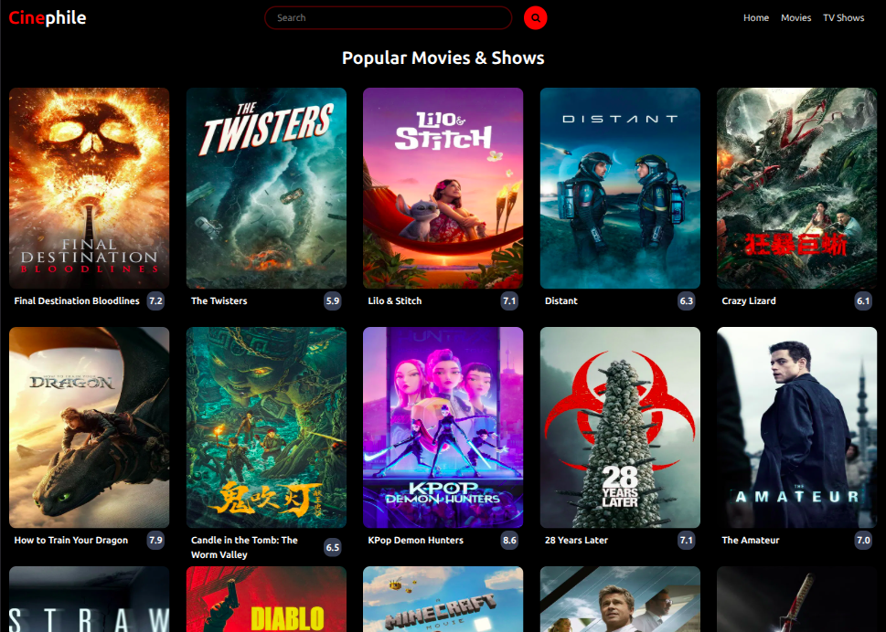
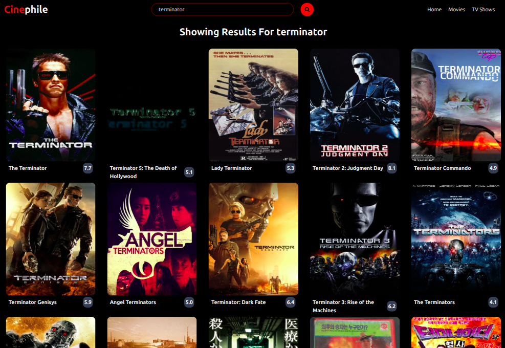
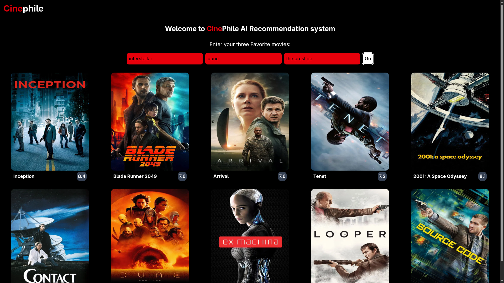

# 🎬 CinePhile
A minimal web project inspired by IMDb that allows users to view popular movies and search for movies, powered by The Movie Database (TMDB) API.

## 📖 Features
- View a list of popular movies and TV shows
- Search for movies using keywords
- Responsive design using Tailwind CSS
- Clean, simple user interface
- Hover to reveal movie overview and rating

## 🛠️ Tech Stack
- Vanilla JavaScript
- HTML5
- Tailwind CSS
- Node + Express Backend
- TMDB API for movie data

## 📦 Setup Instructions
1.Clone the repository

```bash
git clone https://github.com/shalinv/CinePhile.git
cd CinePhile
```
2.Create a .env File
```bash
API_KEY=[YOUR_API_KEY]
PORT=3000
GEMINI_KEY=[YOUR_GEMINI_KEY]
```
3.Install dependencies

```bash
npm install
```

4.Run the development server

```bash
node server.js
```

5.Open in Browser
```
Visit: http://localhost:3000
```
## Screenshots



